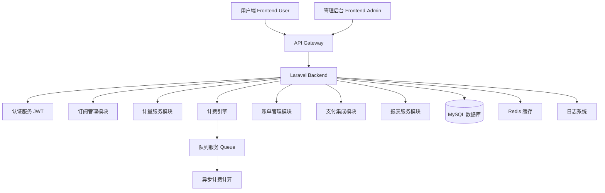

# 复杂计费系统 - 项目设计文档

## 1. 系统架构



## 2. 数据库 ER 图

```mermaid
erDiagram
    users ||--o{ subscriptions : has
    users ||--o{ usage_records : generates
    users ||--o{ bills : owns
    users ||--o{ payments : makes
    
    subscription_plans ||--o{ subscriptions : defines
    subscription_plans ||--o{ plan_features : contains
    
    subscriptions ||--o{ usage_records : tracks
    subscriptions ||--o{ bills : generates
    
    usage_records ||--o{ bill_items : includes
    bills ||--o{ bill_items : contains
    bills ||--o{ payments : paid_by
    
    metering_dimensions ||--o{ usage_records : measures
    
    subscription_plans {
        bigint id PK
        string name
        string code
        decimal price
        string billing_cycle
        json features
        boolean is_active
        timestamps
    }
    
    subscriptions {
        bigint id PK
        bigint user_id FK
        bigint plan_id FK
        string status
        datetime start_date
        datetime end_date
        datetime cancelled_at
        timestamps
    }
    
    metering_dimensions {
        bigint id PK
        string code
        string name
        string unit
        decimal unit_price
        boolean is_active
        timestamps
    }
    
    usage_records {
        bigint id PK
        bigint user_id FK
        bigint subscription_id FK
        bigint dimension_id FK
        decimal quantity
        datetime recorded_at
        json metadata
        timestamps
    }
    
    bills {
        bigint id PK
        bigint user_id FK
        bigint subscription_id FK
        string bill_number
        decimal subscription_fee
        decimal usage_fee
        decimal total_amount
        string status
        datetime period_start
        datetime period_end
        datetime due_date
        timestamps
    }
    
    bill_items {
        bigint id PK
        bigint bill_id FK
        bigint usage_record_id FK
        string item_type
        string description
        decimal quantity
        decimal unit_price
        decimal amount
        timestamps
    }
    
    payments {
        bigint id PK
        bigint user_id FK
        bigint bill_id FK
        string payment_method
        decimal amount
        string status
        string transaction_id
        json payment_data
        timestamps
    }
```

## 3. 接口清单

### 3.1 认证模块 (AuthController)
- `POST /api/auth/login` - 用户登录
- `POST /api/auth/logout` - 用户登出
- `POST /api/auth/refresh` - 刷新Token
- `GET /api/auth/me` - 获取当前用户信息

### 3.2 订阅管理模块 (SubscriptionController)
- `GET /api/subscriptions/plans` - 获取所有订阅计划
- `GET /api/subscriptions/plans/{id}` - 获取订阅计划详情
- `POST /api/subscriptions` - 创建订阅
- `GET /api/subscriptions` - 获取用户订阅列表
- `GET /api/subscriptions/{id}` - 获取订阅详情
- `PUT /api/subscriptions/{id}/upgrade` - 升级订阅
- `PUT /api/subscriptions/{id}/downgrade` - 降级订阅
- `POST /api/subscriptions/{id}/cancel` - 取消订阅

### 3.3 使用量计量模块 (UsageController)
- `POST /api/usage/record` - 记录使用量
- `GET /api/usage/dimensions` - 获取计量维度列表
- `GET /api/usage/records` - 获取使用量记录列表
- `GET /api/usage/statistics` - 获取使用量统计

### 3.4 计费引擎模块 (BillingController)
- `POST /api/billing/calculate` - 手动触发计费计算
- `GET /api/billing/rules` - 获取计费规则

### 3.5 账单管理模块 (BillController)
- `GET /api/bills` - 获取账单列表
- `GET /api/bills/{id}` - 获取账单详情
- `GET /api/bills/{id}/items` - 获取账单明细
- `POST /api/bills/{id}/download` - 下载账单PDF

### 3.6 支付模块 (PaymentController)
- `POST /api/payments` - 创建支付
- `GET /api/payments` - 获取支付记录
- `GET /api/payments/{id}` - 获取支付详情
- `POST /api/payments/{id}/callback` - 支付回调

### 3.7 财务报表模块 (ReportController)
- `GET /api/reports/overview` - 获取财务概览
- `GET /api/reports/usage` - 获取使用量报表
- `GET /api/reports/revenue` - 获取收入报表
- `GET /api/reports/export` - 导出报表

### 3.8 管理后台模块 (AdminController)
- `GET /api/admin/users` - 用户管理
- `GET /api/admin/subscriptions` - 订阅管理
- `GET /api/admin/bills` - 账单管理
- `GET /api/admin/plans` - 订阅计划管理
- `POST /api/admin/plans` - 创建订阅计划
- `PUT /api/admin/plans/{id}` - 更新订阅计划
- `GET /api/admin/metering-dimensions` - 计量维度管理
- `POST /api/admin/metering-dimensions` - 创建计量维度

## 4. UI/UX 规范

### 4.1 主色调
- 主色：`#409EFF` (Element Plus 默认蓝色)
- 成功色：`#67C23A`
- 警告色：`#E6A23C`
- 危险色：`#F56C6C`
- 信息色：`#909399`

### 4.2 字体规范
- 主字体：`-apple-system, BlinkMacSystemFont, 'Segoe UI', Roboto, 'Helvetica Neue', Arial, sans-serif`
- 标题字号：`24px / 20px / 18px`
- 正文字号：`14px`
- 辅助字号：`12px`

### 4.3 间距规范
- 基础间距单位：`8px`
- 常用间距：`8px / 16px / 24px / 32px`
- 卡片内边距：`24px`
- 页面边距：`24px`

### 4.4 卡片样式
- 圆角：`8px`
- 阴影：`0 2px 12px 0 rgba(0, 0, 0, 0.1)`
- 背景：`#FFFFFF`
- 边框：`1px solid #EBEEF5`

### 4.5 布局规范
- 使用 Element Plus 的 `el-row` 和 `el-col` 栅格系统
- 响应式断点：`xs: <768px, sm: ≥768px, md: ≥992px, lg: ≥1200px, xl: ≥1920px`

## 5. 技术栈

### 后端
- Laravel 12
- MySQL 8.0
- Redis
- JWT 认证
- 队列系统（Redis Queue）

### 前端
- Vue 3 + Composition API
- Vite
- Element Plus
- Axios
- Pinia
- SCSS

## 6. 核心业务逻辑

### 6.1 订阅计费模式
- 基于订阅计划的固定费用
- 支持月付、年付等不同计费周期
- 订阅计划包含不同的功能权益

### 6.2 计量付费模式
- 基于实际使用量计算费用
- 支持多个计量维度（如API调用次数、存储空间、带宽等）
- 每个维度有独立的单价

### 6.3 混合计费
- 订阅费用 + 超出部分的使用量费用
- 订阅计划可能包含一定额度的免费使用量

### 6.4 计费引擎
- 异步处理计费计算（使用队列）
- 支持按周期自动计费
- 支持手动触发计费

## 7. 扩展性设计

### 7.1 订阅计划扩展
- 通过数据库配置，无需修改代码即可添加新计划
- 支持计划功能特性的JSON配置

### 7.2 计量维度扩展
- 通过管理后台动态添加计量维度
- 每个维度独立配置单价和单位

### 7.3 支付方式扩展
- 支付方式通过策略模式实现
- 易于添加新的支付渠道
